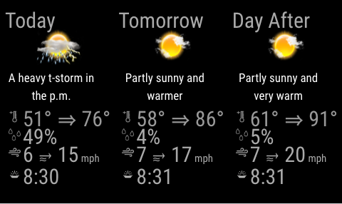

# MMM-AC-3Day-Forecast


This a module for the [MagicMirror](https://github.com/MichMich/MagicMirror/tree/develop).  This module shows a 3 day forecast (today, tomorrow and the day after) using the Wunderground API. It displays the overall weather condition, highest temperature, likely-hood of rain, average humidity, highest windspeed and its direction forecast.  This is designed to compliment the [MMM-Weather-Now](https://github.com/nigel-daniels/MMM-Weather-Now) module.<br>  
**Note:** The Weather company has ceased the free API that this module was based on, as a result this is now based on the API offered by [BitWeather](https://www.weatherbit.io). If you are updating to this version then please don't forget to update your config too!

## Installation
1. Navigate into your MagicMirror's `modules` folder and execute `git clone https://github.com/nigel-daniels/MMM-3Day-Forecast`.  A new folder `MMM-3Day-Forecast` will appear, navigate into it.
2. Execute `npm install` to install the node dependencies.

## Config
The entry in `config.js` can include the following options:

|Option|Description|
|---|---|
|`apikey`|**Required** This is the API key you need to use to request weather data from the Weather Underground site.  Details on how to request an API key can be found [here](https://www.weatherbit.io/account/create)<br><br>**Type:** `string`<br>**Default value:** `null`|
|`loc`|This is the loaction code for the city you want to get the weather for, from Accuweather location API call.<br><br>**Type:** `number`<br>**Default value:** `0`|
|`units`|Option to show units in metric.<br>**Type** `string` Use `true` for metric OR `false` for imperial.<br>**Default value:** `M`|
|`lang`|This is the two character country code for the language you want the weather in.\*<br><br>**Type** `string`<br>**Default value** `en-us`|
|`interval`|How often the weather is updated.<br><br>**Type:** `integer`<br>**Default value:** `1800000 // 30 minutes`|

Here is an example of an entry in `config.js`
```
{
    module:     'MMM-AC-3Day-Forecast',
    position:   'top_left',
	config: {
		apikey:    'xxxxxxxxxxxxxxxxxxxxxx',
		loc:        '347810',
		metric:     'false',
		lang:       'en-us',
		interval:   18000000
	}
},
```

## Dependencies
- [request](https://www.npmjs.com/package/request) (installed via `npm install`)

## Notes
I hope you like this module, I know it duplicates many other weather modules, however I missed my home-brew mirrors weather information so I recreated it for MM2.  Feel free to submit pull requests or post issues and I'll do my best to respond.

## Thanks To...
- [Michael Teeuw](https://github.com/MichMich) for the [MagicMirror2](https://github.com/MichMich/MagicMirror/tree/develop) framework that made this module possible.
- [Sam Lewis](https://github.com/SamLewis0602) whose [MMM-Traffic](https://github.com/SamLewis0602/MMM-Traffic) module I use and whose code I learnt a great deal from.
- [BitWeather](https://www.weatherbit.io) for the helpful guides and information they publish on their API.
